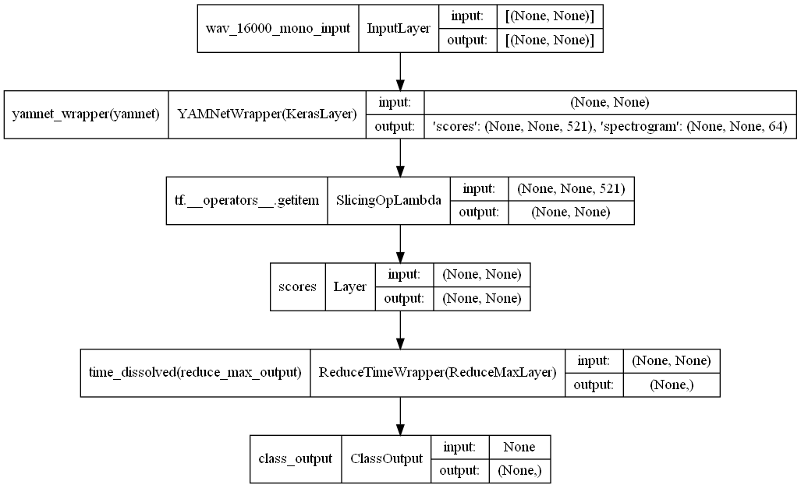
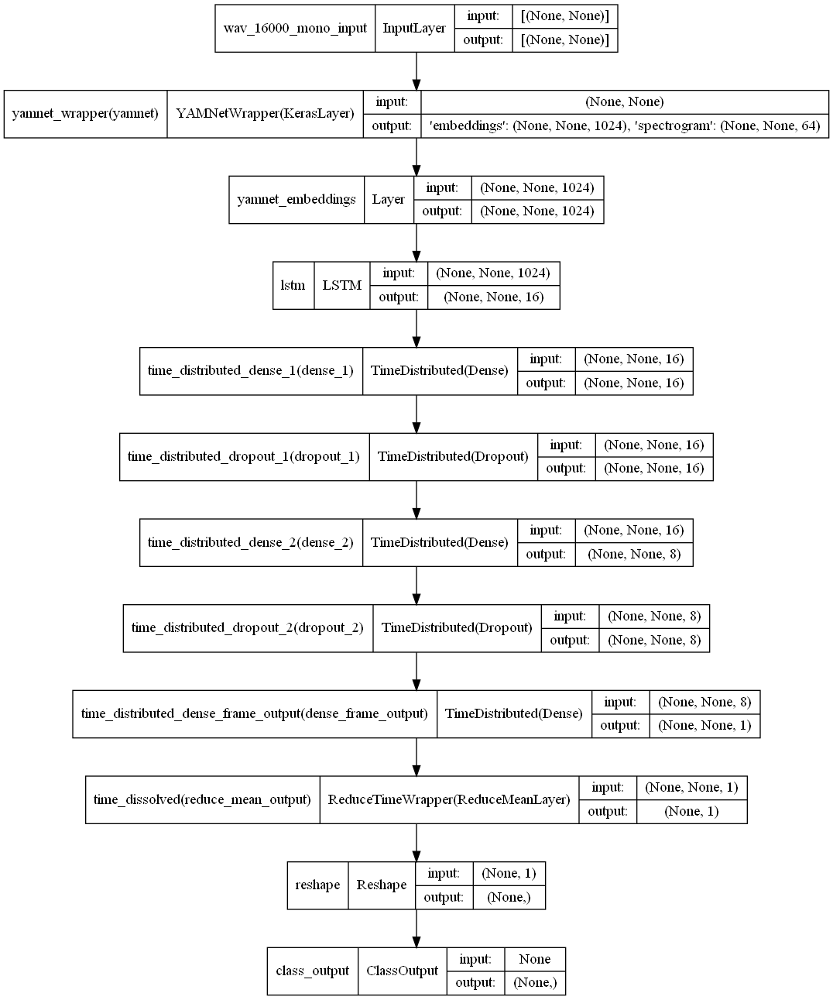

# Bicycle Bell Sound Event Detection Models
**Author: Clemens Kubach**

This repository is one of three for my bachelor thesis on "Development of an Embedded System 
for Detecting Acoustic Alert Signals of Cyclists Using Neural Networks".

It contains the architectures of the used neural networks to detect the sound event of cyclists using their bicycle bell. Written in Python 3.9.

The other related repositories are:
- [bicycle-bell-sed-pipeline](https://github.com/ClemensKubach/bicycle-bell-sed-pipeline)
- [bicycle-bell-sed-software](https://github.com/ClemensKubach/bicycle-bell-sed-software)


## Usage
You can use this package with:
```
pip install git+https://github.com/ClemensKubach/bicycle-bell-sed-models.git
```

If this repository is private, use `pip install git+https://{gh_token}@github.com/ClemensKubach/bicycle-bell-sed-models.git`
where `{gh_token}` is your personal access token to your github account with the rights to clone private repositories. You must have granted permissions to access this repository from GitHub.

## Models
There are 3 model configurations...

### CRNN
A model based on a CRNN architecture without any pre-training. Inspired by [[1]](#1).


### YAMNet Base
The pre-trained YAMNet[[2]](#2)[[3]](#3) base model without any transfer learning. The resulting probability values for the class "Bicycle bell" is directly taken out of the results of all 521 classes and the maximum probability from the windows of the wave input file is taken.



### YAMNet Extended
An extended pre-trained YAMNet model with transfer learning using embeddings of the base model[[2]](#2)[[3]](#3). A classifier with LSTM and dense layers are followed.


 

## References
<a id="1">[1]</a>
[Lim, H., Park, J., & Han, Y. (2017, November). Rare sound event detection using 1D convolutional recurrent neural networks. In Proceedings of the detection and classification of acoustic scenes and events 2017 workshop (pp. 80-84).](http://dcase.community/documents/challenge2017/technical_reports/DCASE2017_Lim_204.pdf)

<a id="2">[2]</a>
https://tfhub.dev/google/yamnet/1

<a id="3">[3]</a>
https://github.com/tensorflow/models/tree/master/research/audioset/yamnet